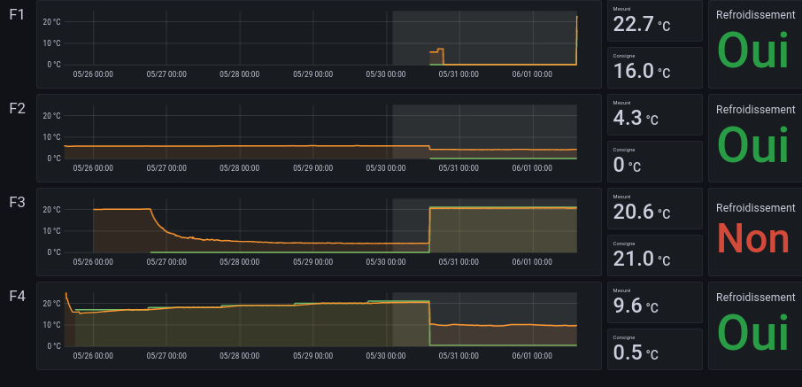

# Supervision

This repository contains the sources for a software able to do supervision of
the temperatures in our fermenters, at the [Brasserie du Vieux Singe (FR,
Rennes)](https://www.vieuxsinge.com).

We decided to implement a solution like this to be able to be notified when
problem occur with our cold group.

When problems are detected, a notification is sent to a [Signal](https://signal.org) group.



The script uses Python, and we make it run in a cronjob.

Data is collected locally via [connected
thermostats](https://github.com/vieuxsinge/stc1000esp) made out of STC1000.
They send messages via [MQTT](https://mqtt.org/) via Wifi to our server.

Messages are then aggregated by
[Telegraf](https://www.influxdata.com/time-series-platform/telegraf/) in an
[InfluxDB](https://www.influxdata.com/), and visualized via
[Grafana](https://grafana.com/).

(The script messages are implemented in French for now, as we are the only one using the tool)

## Exemples

```
$ python3 analyse_and_alert.py --credentials /home/supervision/credentials.txt
.d8888b.                                              d8b          d8b
d88P  Y88b                                             Y8P          Y8P
Y88b.
"Y888b.   888  888 88888b.   .d88b.  888d888 888  888 888 .d8888b  888  .d88b.  88888b.
   "Y88b. 888  888 888 "88b d8P  Y8b 888P"   888  888 888 88K      888 d88""88b 888 "88b
     "888 888  888 888  888 88888888 888     Y88  88P 888 "Y8888b. 888 888  888 888  888
Y88b  d88P Y88b 888 888 d88P Y8b.     888      Y8bd8P  888      X88 888 Y88..88P 888  888
"Y8888P"   "Y88888 88888P"   "Y8888  888       Y88P   888  88888P' 888  "Y88P"  888  888
                   888
                   888                 
                   888

Recherche d'anomalies pour les fermenteurs f1, f2, f3
par tranches de 180 minutes.

🤷  Aucune température n'est enregistrée par le fermenteur f1.
🎉  Pas d'anomalies detectées pour f2 (consigne à 0°C): 5.95, 5.95, 5.95, 5.95.
🎉  Pas d'anomalies detectées pour f3 (consigne à 0°C): 4.25, 4.25, 4.25, 4.25.
```

## Installation

### Dépendences

The system relies on [signal-cli](https://github.com/AsamK/signal-cli/) to send
notifications to a Signal group. 

You then have to install it. Here are some simple instructions to do so on Debian 10.

On Debian, you can follow [the instructions on this
page](https://packaging.gitlab.io/signal-cli/installation/standalone/). You
need to install `signal-cli-service` and `signal-cli-native`.

Once this is done, you need to configure signal-cli to connect with a Signal
account.

You can configure it with a phone number as a primary device or link an
existing device. We're linking here with a secondary device.

```bash
signal-cli-native link -n "Supervision brasserie" | tee >(xargs -L 1 qrencode -t utf8)
```

Then scan this QRcode on your signal app on Android.

You then need to sync the messages :

```bash
signal-cli-native -u +phone-number receive
```

And then you need to get the group ID you want to use.

```bash
signal-cli-native listGroups
```


```bash
git clone https://github.com/vieuxsinge/supervision.git && cd supervision
python -m venv .venv
.venv/bin/pip install -r requirements.txt
```

## Configuration

We've put a bunch of configuration files in the "config" folder.

- [The crontab file](config/crontab) for the script to run on its own ;
- [Grafana config files in JSON](config/grafana.json) to visualize data ;
- [Mosquito configuration](config/mosquito.conf) to receive data ;
- [Telegraf configuration](config/telegraf.conf) to aggregate the data.
